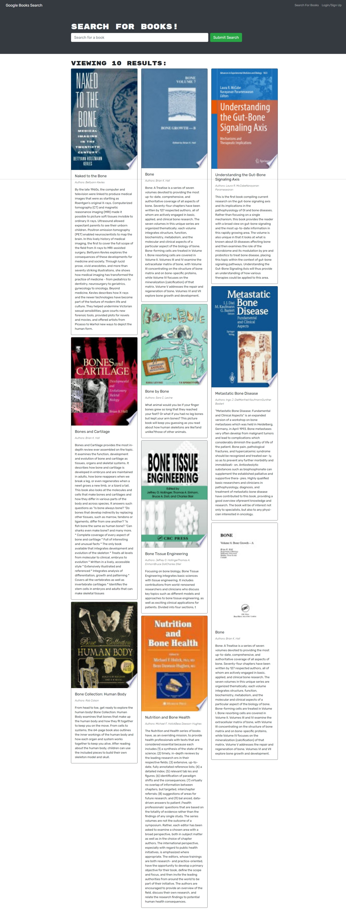

<h1 align="center">MERN: Book Search Engine</h1>

<div align="center">
   Solution for a challenge from  <a href=https://git.bootcampcontent.com/University-of-California---Irvine/UCI-VIRT-FSF-PT-06-2023-U-LOLC/-/tree/main/21-MERN/02-Challenge?ref_type=heads" target="_blank">University of California - Irvine
UCI-VIRT-FSF-PT-06-2023-U-LOLC</a>.
</div>

<div align="center">
  <h3>
    <a href="https://github.com/drbv27/booksearch">
      Solution
    </a>
    <span> | </span>
    <a href="https://git.bootcampcontent.com/University-of-California---Irvine/UCI-VIRT-FSF-PT-06-2023-U-LOLC/-/tree/main/13-ORM/02-Challenge">
      Challenge
    </a>
    <span> | </span>
    <a href="https://booksearch-tan.vercel.app/">
      Demo
    </a>
  </h3>
</div>

<p align="center">
    
    
    
    
    <a href="https://github.com/jpd61"></a>
</p>


## Table of Contents

- [Description](#description)
- [Technology](#Technology)
- [Installation](#installation)
- [Usage](#usage)
- [License](#license)
- [Contribution](#contribution)
- [Questions](#questions)

## Description:

This application allows users to search for new books from Google's Book API. Users can log in to save the book they would like to purchase, as well as to remove the books from their library.

## Technology:

Project is created with:

- MongoDB
- Express.js
- React.js
- Node.js
- JavaScript
- GraphQL API
- Apollo Server

## Installation

To run this project, install it locally using npm:

```
npm install
```

## Usage

After installing npm packages, the application will be invoked by using the following command:

```
npm run develop
```

#### Vercel Deployment

[Click me to see app!](https://booksearch-tan.vercel.app/)

- Create Vercel deployment 

  ```
  configurate "create react app" into vercel after connect you github repo
  configurate your MONGO_URI  on environemnt variables
  ```

- Create database on MongoDB Atlas:

  ```
  Cluster ➡️ Collections ➡️ Create Database
  ```

- Git push
  ```
  git push 
  ```

#### App Screenshot



## License

[](https://opensource.org/licenses/MIT) <br>
This project is licensed under MIT, for more information please visit [this website](https://opensource.org/licenses/MIT)

## Contribution

N/A

## Questions?

Please feel free to contact me if you need any further information:

- [Email](mailto:drbv27@gmail.com)
- [Github Profile](https://github.com/drbv27)
